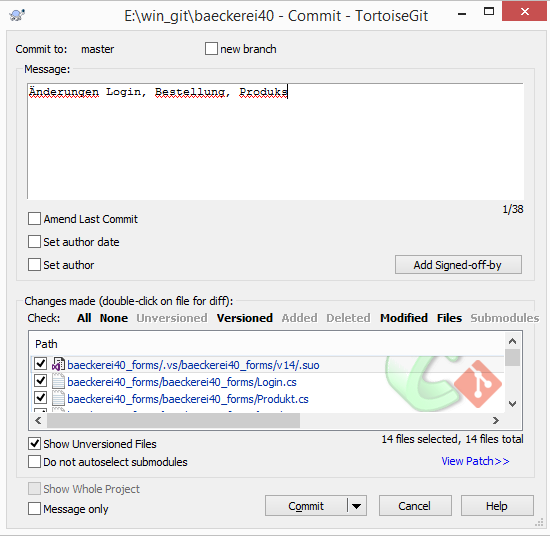
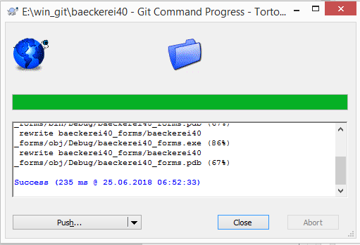

# Projekt für das Modul 'Software- und IT-Management 2018' an der Uni Jena 

## 'Die Bäckerei 4.0' - Kurze Projektbeschreibung
Schlankes ERP mit Controlling Funktionen in C#

## Deadlines
* ~~Meilenstein 1 - Lastenheft: 7.5.~~
* ~~Meilenstein 2 - EPK und Klassendiagramm: 11.6.~~
* Meilenstein 3 - Fertige Software: 15.8.

## Meetings
* ~~25.4. - 16 Uhr c.t. - PC Pool B - Erstellung Pflichtenheft~~
* ~~26.4. - 12 Uhr s.t - Büro Stephan - Kundenbesprechung Pflichtenheft~~
* ~~02.5. - 16 Uhr c.t. - PC Pool B - Finalisierung Pflichtenheft~~
* ~~26.6. - 16 Uhr c.t. - PC Pool C - Abstimmung bzgl. Programmierung / Aufgabenteilung~~
* 12.6. - nach der Klausur - SR 306 - Status Treffen
* 01.8. - t.b.a - Stefan Büro - Abgabe / Software mit Stefan kurz durchklicken und besprechen

## Arbeitsteilung

### Meilenstein 1
* Lastenheft: Artur, Jann, Sophie, Selest, Tobias

### Meilenstein 2
* EPK: Artur, Jann, Selest
* Klassendiagramm: Sophie, Tobias
* Zusammenführung als Word: Tobias

### Meilenstein 3
* Tab Bestellung: Tobias
* Tab Produktion: Tobias
* Tab Lager: Selest, Artur, Sophie
* Tab Komissionierung:
* Tab Rohstoffe:-> wird zu Rezeptverwaltung: Selest, Artur, Sophie
* Tab Controlling:
* Erstellung der Access-DB + ERD: Tobias
* Erstellung GUI-Konzept: Tobias

### sonstiges
* Kommunikarion mit Projekt Owner: Sophie
* git Administration: Tobias

## Git Client
Um unsere Änderungen im Visual Studio hochzuladen verwenden wir am besten:
* https://tortoisegit.org/

### Workflow:
* Rechtsklick -> Git commit "master" -> Alle Dateien auswählen -> Commit-Nachricht eingeben -> Commit  

* Push  

